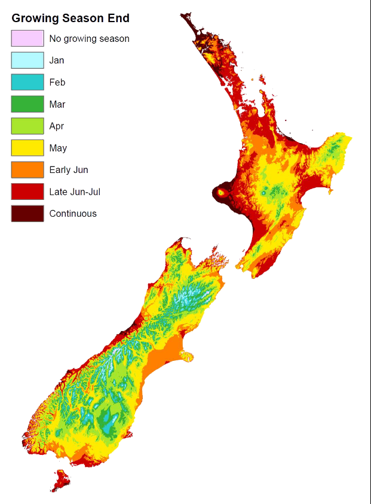

# chelsa-growing-season

## Background

In [_Wetland delineation hydrology tool for Aotearoa New Zealand_](https://environment.govt.nz/assets/publications/wetland-hydrology-tool-final.pdf)[[1]](#1), §2 pp11-14, a method is briefly described for determining a growing season using NIWA's National Climate Database (https://cliflo.niwa.co.nz/).

> **Growing season**
>
> The growing season is under way if plants are accumulating biomass or soil temperatures are above the threshold that allows for microbial activity (US Army Corps of Engineers, 2010). The growing season starts when one of these factors begins, and ends when the most persistent factor ceases.
>
> 1. Plant growth
> 
> Plant growth assessments should be undertaken for non-evergreen vascular species. This may be problematic in New Zealand because most native species are evergreen (appendix 3 contains a list of deciduous native trees and shrubs). However, if two or more exotic deciduous species are nearby these may be used for this index. The growing season has begun if two or more species exhibit one or more of the following:
> 
> - emergence of herbaceous plants
> - new growth from vegetative crowns (eg, bulbs)
> - coleoptile and/or cotyledon emergence
> - bud burst on woody plants
> - emergence or elongation of leaves of woody plants
> - emergence or opening of flowers
> 
> The end of the growing season is indicated by woody deciduous plants entering senescence or herbaceous plants ceasing flowering and their leaves dying. Determining the end of the growing season can be complicated by drought conditions leading to early senescence or potentially a return to growth later in the year. In this case, soil temperature measurements may be easier and more reliable for determining the end of the growing season
> 
> 2. Soil temperature
> 
> Soil temperature can be used to signal the start and end of the growing season. The growing season begins when minimum soil temperatures are above 5 degrees Celsius in the top 30 centimetres of the soil profile. If the soil temperature is not known and on-site data collection not practical, then the growing season can be approximated as the period when air temperatures are above –2.2 degrees Celsius, based on long-term records. An air temperature of –2.2 degrees Celsius or lower represents a ‘killing’ frost, whereby virtually all vegetation is affected to some degree and is usually measured at a frequency of 5 years in 10 (US Army Corps of Engineers, 2010)[[2]](#2).

This next paragraphs are the key description of the method:

> To define a practical solution for determining the growing season, we worked with the National Institute of Water and Atmospheric Research to produce maps of New Zealand showing the first day of the growing season as determined by the day of the last killing frost, and the end of the growing season as determined by the day of the first killing frost. Daily minimum air temperatures were used (measured at 1.2 metres above the ground surface) for each day from all New Zealand climate stations (n=187), with a minimum of six years of data, between 2001 and 2020 (appendix 2). Climate stations established for a longer period were weighted more than climate stations established for a shorter period. Because climate station data are insufficient between 2002 and 2010 in the Northland, Taranaki coast, Gisborne and Manawatu–Wanganui regions (appendix 2), the establishment of the growing season may be best assessed from the nearest meteorological station
through the [National Climate Database](https://cliflo.niwa.co.nz/).
>
> For each year, and each climate station, the day of the year with the first and last occurrence of air temperatures lower than –2.2 degrees Celsius was extracted. The median day of the year indicating the first and last killing frost dates was determined and interpolated to 500-metre grids using smoothing spline interpolation with elevation as a covariate (as also undertaken by Wratt et al, 2006)[[3]](#3) and presented as maps of New Zealand showing the start and end of the growing season (figure 3 and figure 4).
>
> Start and end dates of the growing season for the main office locations for 14 local authorities across New Zealand have been extracted from the map layer to give an indication of the growing season in each region (table 1).

**Table 1**:

| Main office location | Local authority        | Council type      | Growing season start (date) | Growing season end (date) | Growing season length (days) |
|----------------------|------------------------|-------------------|-----------------------------|---------------------------|------------------------------|
| Whangarei            | Northland              | Regional          | Continous                   | Continuous                | Continuous                   |
| Auckland             | Auckland               | Unitary City      | 12 July                     | 23 June                   | 347                          |
| Hamilton             | Waikato                | Regional          | 1 August                    | 12 June                   | 316                          |
| Whakatane            | Bay of Plenty          | Regional          | 14 July                     | 4 July                    | 356                          |
| Napier               | Hakwe's Bay            | Regional          | 4 August                    | 19 June                   | 319                          |
| Palmerston North     | Horizons               | Regional          | 19 July                     | 23 June                   | 339                          |
| Wellington           | Greater Wellington     | Regional          | 11 August                   | 13 June                   | 306                          |
| Nelson               | Nelson                 | Unitary City      | 25 July                     | 26 June                   | 336                          |
| Nelson               | Tasman                 | Unitary District  | 5 August                    | 17 July                   | 316                          |
| Blenheim             | Marlborough            | Unityary District | 4 August                    | 14 June                   | 314                          |
| Christchurch         | Environment Canterbury | Regional          | 16 August                   | 11 June                   | 299                          |
| Greymouth            | West Coast             | Regional          | 24 July                     | 18 June                   | 329                          |
| Dunedin              | Otago                  | Regional          | 14 August                   | 1 July                    | 321                          |

**Note**: only local authorities with sufficient data have been included.

**Figure 3: Map of New Zealand indicating the start of the growing season**

**Note**: 'Continous' refers to areas where the growing season occurs all year, and 'no growing season' refers to areas where no growing season occurs.

**Figure 4: Map of New Zealand indicating the end of the growing season**

**Note**: 'Continous' refers to areas where the growing season occurs all year, and 'no growing season' refers to areas where no growing season occurs.

---

Wratt et al. (2006)[[3]](#3) provide further detail about a thin plate spline smoothing for climate variables. While conceptually helpful, code, data and smoothing parameters are still not available and attempts made in this repository to reproduce these maps have been met with mixed success.

**If you are interested in re-attempting this to improve fidelity to the original method and outut, please feel free to contribute improvements back to this repository.**

## Reproduction

Unfortunately the images in [[1]](#1) are the only representations of the growing season data; it is not available as a raster geospatial dataset.

This repository contains code used to attempt a reproduction of these maps. However, as there is insufficient detail in the described method, this was ultimately unsuccessful.

As an alternative option to make public some useful information, we also generated growing season maps using freely available global climate data from [CHELSA](https://chelsa-climate.org/) (climatologies at high resolution for the earth's land surface areas).

This was more successful, although the data is relatively low resolution (30 arc seconds), and not in an appropriate projected coordinate system (it has not been resampled). This repository also contains code for producing the derived growing season maps from CHELSA data, which should be considered the primary output—although the CliFlo derived maps are available for download too).

### Key missing details

- Is interpolation peformed on the temperature data itself (daily), or on median day-of-year values calculated at the station values?
- If the latter, what value is used to represent stations that do not record frost in the median case in the interpolation?
- How is the population of stations selected? The report refers to 184 stations as being "all climate stations" for the period, but the actual number is greater than this. I have been able to get to 186, but only by:
  - applying a filter using the Mahalanobis distance with respect to the combined elevation and the respective median value (i.e. removing outliers with reference to altitude).
  - removing stations that are spatially-coincident within a threshold sitance (typically: keeping new stations that are replacements for older stations --- but this itself influences the value of the median as each _individual_ station has its own temporal record).
- For the thin-plate smoothing, what parameters have been selected (ε), and why?
- Why has the distance to coast not been included as a covariate?

## Results

### CHELSA

| main_office_location | local_authority        | council_type     | median_first_frost | median_last_frost |
|----------------------|------------------------|------------------|--------------------|-------------------|
| Whangarei            | Northland              | Regional         | Continuous         | Continuous        |
| Auckland             | Auckland               | Unitary City     | Continuous         | Continuous        |
| Hamilton             | Waikato                | Regional         | 12 Jun             | 20 Aug            |
| Whakatane            | Bay of Plenty          | Regional         | Continuous         | Continuous        |
| Napier               | Hawke's Bay            | Regional         | Continuous         | Continuous        |
| Palmerston North     | Horizons               | Regional         | 26 Jun             | 12 Jul            |
| Wellington           | Greater Wellington     | Regional         | Continuous         | Continuous        |
| Nelson               | Nelson                 | Unitary city     | 3 Jun              | 19 Jun            |
| Nelson               | Tasman                 | Unitary district | 26 Jun             | 24 Jul            |
| Blenheim             | Marlborough            | Unitary district | 26 Jun             | 26 Jun            |
| Christchurch         | Environment Canterbury | Regional         | 17 Jun             | 7 Jul             |
| Greymouth            | West Coast             | Regional         | Continuous         | Continuous        |
| Dunedin              | Otago                  | Regional         | 1 Jul              | 31 Jul            |

Citations:

Stefan Lange, Matthias Mengel, Simon Treu, Matthias Büchner (2023): ISIMIP3a atmospheric climate input data (v1.2). ISIMIP Repository. https://doi.org/10.48364/ISIMIP.982724.2

Dirk N. Karger, Stefan Lange, Chantal Hari, Christopher P.O. Reyer, Niklaus E. Zimmermann (2022): CHELSA-W5E5 v1.0: W5E5 v1.0 downscaled with CHELSA v2.0. ISIMIP Repository. https://doi.org/10.48364/ISIMIP.836809.3

### CliFlo

## Method

### CHELSA

1. Data is downloaded (manually) from Chelsa as monthly NetCDF data with a daily climate record. Bounding box: -52.659 to -34.111 (latitude), 165.742 183.889 (longitude) from 1995 to 2016 (inclusive). This is manual because the download requires a request that generates a link that expires.
2. Unzip data. (Rule `unzip_climate_data`.)
3. Produce annual datasets indicating the first and last day of the year for which there was a frost. (Rule `calculate_frost_margins`)
4. Calculate the median frost day for the first and last frost across a range of years. The output is written as NetCDF data, to match the input. (Rule `median_frost_doy`.)
5. We can also produce a summary table to compare against the baseline data. (Rule `summary_table`.)

### CliFlo

1. Data is downloaded from CliFlo. This is done in a semi-automated fashion, but is not part of the workflow because it does require manual intervention. (The reason is that the CliFlo database has a download limit of 2 million rows, which this exceeds. When the limit is reached, no data is returned until the user manually resets the user account.)
2. CliFlo data is cleaned. Duplicate data (due to the semi-automated download process) is removed. Interpolation is performed to fill some small gaps (up to three days by default) using an [Akima spline interpolation](https://en.wikipedia.org/wiki/Akima_spline). In the same step, the first and last date of the frost threshold being breached is recorded, on an annual basis. (Rule `clean_cliflo_data`.)
3. The median frost first/last day-of-year is captured for each station, over a period. The growing season is determined by these values. By default, stations are excluded from the result set if they are not present in the record for 6/18 of the requested period (in years). Also, stations are filtered out if they are within a distance threshold of other stations (the station with the longest record within the period is kept). (Rule `median_cliflo_data`)
4. To produce an interpolated result, we use a thin plate spline radial basis function. The dependent variables are the median day of year (or median growing season period, in days). The covariates are elevation and coastal proximity. Stations may be removed if they exceed a Mahalanobis distance threshold (considering the dependent variable, together with elevation). The growing season is interpolated first (using all remaining stations) then the median date of the last killing frost (omitting stations with no frost record to avoid specifying a fill value). The median date of the first frost is then derived from these estimates so that the output is internally consistent (i.e. the growing season length accords with the median dates). The output is written as three bands of a GeoTIFF with band descriptions. (Rule `thin_plate_spline`).

Various parameters can be adjusted without editing the scripts, such as the value of ε, the number of neighbours to consider, the smoothness of the approximation, whether to perform outlier detection, the outlier threshold, the spatial coincidence threshold, whether to include coastal proximty as a covariate, and whether to log transform the coastal proximity measurement.

Results demonstrated here are using the default parameters for the workflow, but results can vary widely depending on the decisions made for these parameters.

Note that increasing the resolution, or the number of stations, has a strong influence on the computational intensity of the spline calculation. The default values were adequate for a 13th Gen Intel® Core™ i7-1370P × 20 CPU with 16 GB of RAM. (The computation takes only a few seconds.)

## Rulegraph / DAG

## References

<a id="1">[1]</a>
Ministry for the Environment. (2021).
Wetland delineation hydrology tool for Aotearoa New Zealand. Wellington: Ministry for the Environment.

<a id="2">[2]</a>
US Army Corps of Engineers. (2010).
Regional supplement to the Corps of Engineers wetland delineation manual: Western Mountains, Valleys and Coast Region (Version 2.0). Wetlands Regulatory Assistance Program Report ERDC/EL TR-10-3. Vicksburg, USA: US Army Engineer Research and Development Center.

<a id="3">[3]</a>
Wratt DS, Tait A, Griffiths G, Espie P, Jessen M, Keys J, Ladd M, Lew D, Lowther W, Mitchell N, Morton J, Reid J, Reid S, Richardson A, Sansom J, Shankar U. (2006).
Climate for crops: Integrating climate data with information about soils and crop requirements to reduce risks in agricultural decision making. Meteorological Applications 13: 305–315.